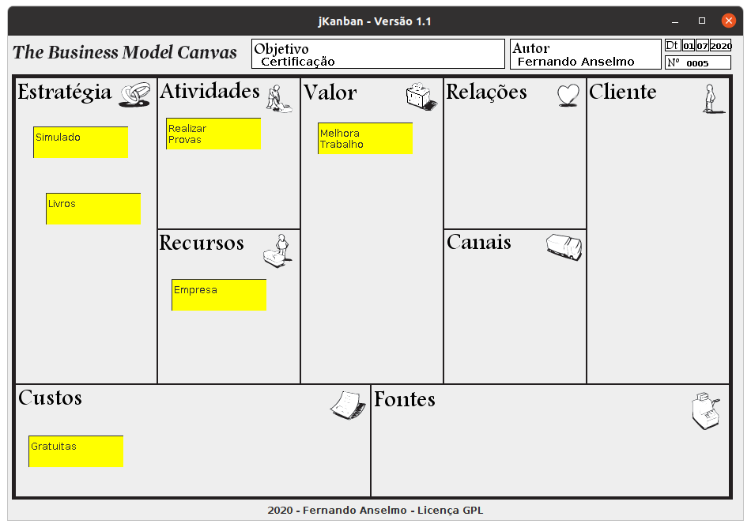

# BMC

## Manual de Uso

Para sua execução é necessário ter o Java instalado (versão JRE). 

Execução:
```
java -jar BCM.jar
```

 

Ao ser aberto, teremos a visão da planilha BCM com suas 9 áreas. Ao clicar com o botão direito do mouse sobre a planilha temos as seguintes opções a disposição:

* Objetivo: objetivo deste projeto
* Autor: nome do autor
* Data: data de criação
* Número: versão do projeto
* Post-it: criação de um Post-It
* Abrir: abrir um projeto
* Salvar: salvar um projeto

Criado o Post-It este pode ser posicionado em qualquer região, ao clicar com o botão direito do mouse sobre este temos as seguintes opções a disposição:

* Descrição: modificar a descrição do Post-It
* Cor de Fundo: modificar a cor de fundo do Post-It, use cores para diferenciar prioridades
* Excluir: eliminar o Post-It

## Software em Sustentação:

**Versão 1.1:**
* Resolvido o problema de travamento
* Ajustes do Sistema conforme o SonarLint.
* Melhora do serviço de postar Post-It.
* Aceleração dos processos para transformar o sistema mais leve.

**Versão 1.0:**

* Criação do Sistema.
* Disponibilização das Funcionalidades desejadas.
